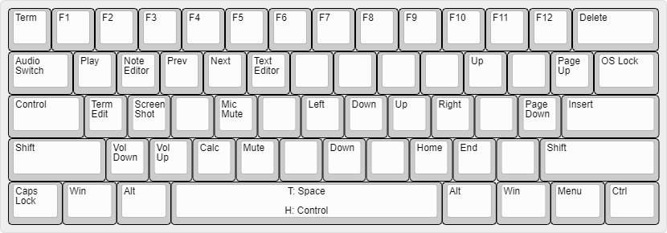

# Daniel Keyboard Repository

## Setup environment
```sh
bash setup_links.sh
```

## Compile firmware
```sh
make keychron/k8_pro/ansi/rgb:danielbibit
```
```sh
qmk compile -kb tada68 -km danielbibit

qmk compile -kb converter/usb_usb/pro_micro -km danielbibit
```
## Layout
### Main

* T: Tap
* H: Hold
* B: Both

### Dan FN

* TermEdit: C-x C-e

### Mouse FN


### Control FN

