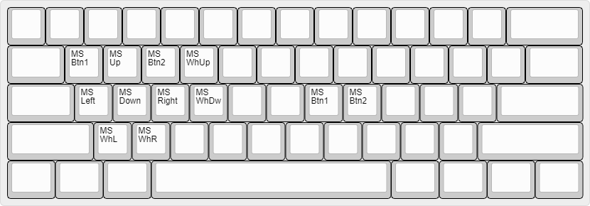

# Daniel Keyboard Repository


## Setup environment
```sh
#Clone this repository with
git clone git@github.com:danielbibit/daniel_qmk_setup.git --recurse-submodules

docker-compose up -d

```
## Compile firmware
```sh
# Compile all fimwares to ./bin/
docker exec -it qmk_setup /bin/bash /workspace/compile_all.sh
```
```sh
make keychron/k8_pro/ansi/rgb:danielbibit
```
```sh
qmk compile -kb tada68 -km danielbibit

qmk compile -kb converter/usb_usb/pro_micro -km danielbibit

make keychron/v4/ansi:danielbibit
```
## Layout
### Main

* T: Tap
* H: Hold
* B: Both

### Game

* Same as Main layout, without LT keys

### Dan FN

* TermEdit: C-x C-e

### Mouse FN


### Control FN

